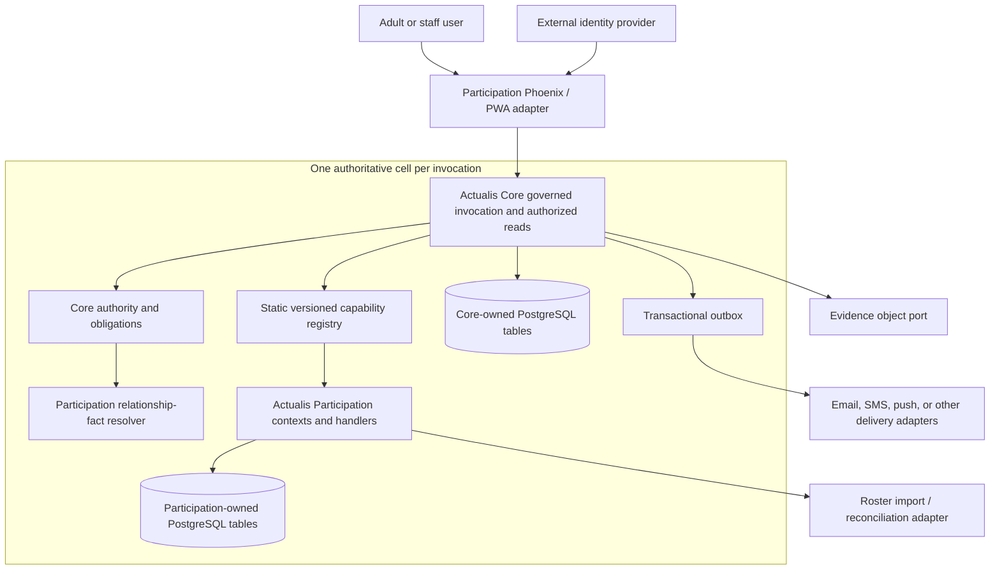

# Participation context map

Status: Proposed target; current state verified from source  
Reviewed source: working tree based on `0f1463d94ff9703134810f9854f7ef03760e8657`  
Reviewed: 2026-07-19  
Owner: Actualis Engineering

## Outcome

This map identifies what exists in the current Actualis umbrella and the target dependency direction
for Actualis Participation. It is architecture evidence, not proof that Participation exists.

## Current executable boundary

```text
actualis_web
  |-- calls actualis_core public runtime/evidence APIs
  `-- calls actualis_manufacturing public product APIs

actualis_core  <--- actualis_manufacturing
      |
      `--- Core-owned transaction over one PostgreSQL repository
```

Current source proves:

- Core defines `Actualis.Capability.Handler`, `Command`, `Registry`, and `CapabilityRuntime`;
- manufacturing implements the handler and owns its product schemas, projections, migrations, and
  tests;
- Core opens the shared transaction and persists receipts/evidence while the product app appends a
  durable domain fact;
- Core production source does not import manufacturing modules; and
- the seam is not yet versioned and has no relationship resolver, explicit cell object,
  deterministic clock/identifier ports, or pending-obligation lifecycle.

## Target system context



## Ownership

| Concern | Core | Participation | Adapter/external system |
| --- | --- | --- | --- |
| Cell | Identity, request scope, authority boundary | Organization meaning and terminology | Later discovery/routing only |
| Principal | Authenticated actor/device context | Adult-to-participant relationships and staff assignments | Identity provider credentials/login UX |
| Participant | Opaque typed subject reference where needed | Participant lifecycle and personal data | Upstream roster may own selected fields |
| Capability | Invocation, version lookup, idempotency, transaction | Input, invariants, handler, effects | Transport parsing and safe response mapping |
| Policy | Evaluation, fields, purpose, obligations, safe reasons | Versioned relationship and target facts | No policy bypass |
| Programme/activity | No product semantics | Full lifecycle and relational state | UI renders authorized view models |
| Readiness | Obligation/evidence envelopes only | Requirements, submissions, attestations, assessment | UI cannot edit readiness directly |
| Welfare | Purpose/field enforcement and evidence metadata | Health/care semantics and projections | Object store holds protected content |
| Facts/delivery | Durable envelope and delivery state | Fact names and minimum domain payload | Provider adapter delivers after commit |
| Migrations | Core migration path | Participation migration path | Release runs explicit pinned order |

## Participation contexts

```text
Directory ---> Programmes ---> Activities ---> Readiness ---> Welfare
    |                              |               |
    `--- relationship facts       `--- registrations

Communications consumes authorized activity audiences and committed facts later; it does not own
membership, readiness, or welfare truth.
```

- `Directory`: organization profile, groups, participants, memberships, responsible parties,
  import provenance.
- `Programmes`: bounded operating years or seasons.
- `Activities`: activities, materialized occurrences, invitations, registrations.
- `Readiness`: versioned requirements, submissions, attestations, assessments, verification,
  governed exceptions.
- `Welfare`: later purpose-limited health declarations, prescriptions, emergency instructions, and
  care records.
- `Communications`: later announcements, emergency broadcasts, and controlled replies.

Calls cross contexts only through their public APIs. Shared identifiers do not authorize reads, and
no context queries another context's private schemas.

## Governed mutation flow

1. The adapter resolves trusted identity and one selected cell.
2. Core validates the generic envelope and exact capability contract version.
3. The product handler canonicalizes domain input without effects.
4. Core begins the transaction and claims or replays the idempotency receipt.
5. Core requests only declared, exact-target relationship facts and evaluates current authority.
6. Core persists a denial/pending obligation or calls the product handler.
7. Participation locks and changes only its owned aggregates.
8. Core stores evidence metadata, bounded domain facts, and the receipt outcome.
9. The transaction commits once; providers and UI invalidation run afterward.

## Boundary rules

- Each authoritative invocation and query belongs to exactly one cell.
- Core never imports `Actualis.Participation` or interprets its payload fields.
- Participation never writes Core tables directly.
- Phoenix, LiveView, jobs, and import workers never call `Repo` to bypass a public context or
  governed capability.
- A shared PostgreSQL connection provides atomicity, not shared ownership.
- Multi-cell surfaces route and reauthorize per cell; they do not join operational cell databases.
- Domain facts are committed facts, not an internal event-bus replacement for direct function calls.
- Package extraction into a service requires measured evidence, not a preference for distribution.

## Update triggers

Re-verify this map when the handler/descriptor contract, cell model, relationship resolver,
obligation lifecycle, package topology, migration runner, web composition, or any Participation
context boundary changes.

