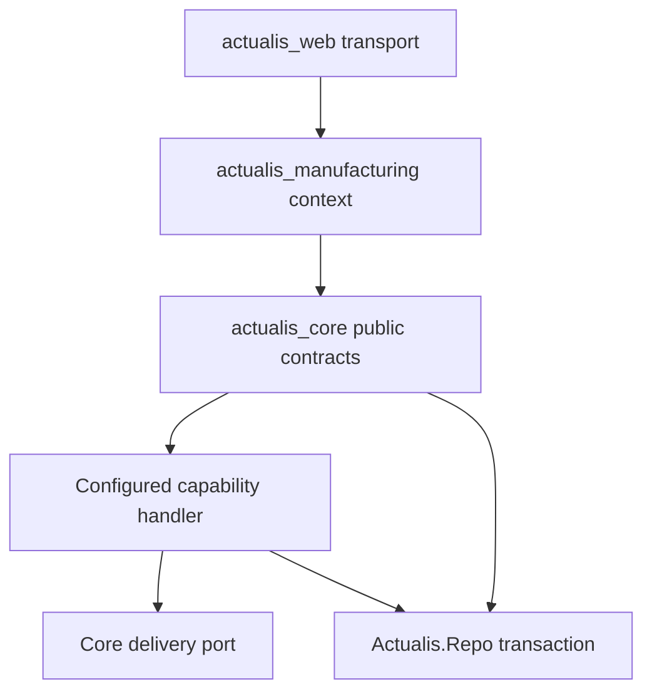
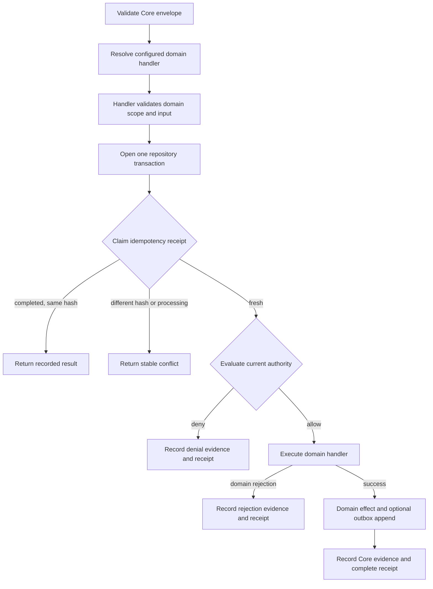

# Actualis Core v0 technical reference

## Current status

Actualis Core is a partial in-process constitutional runtime. It now has an executable boundary
from product applications:

- Core owns governed command validation, configured handler resolution, authority evaluation,
  principal-scoped idempotency, transaction ownership, generic evidence metadata, receipts, and
  the versioned outbox port.
- `actualis_manufacturing` owns pallet, location, movement, manufacturing event payloads, and
  operator and supervisor projections.
- `actualis_web` is a transport adapter that calls the manufacturing context and Core evidence
  context; the public pallet API has not changed.
- A neutral test-only conformance handler proves that Core can authorize and execute a domain
  handler without importing manufacturing modules.

The extraction implements [ADR 0006](../../../architecture/adr/0006-pallet-movement-application-module.md)
without introducing a service boundary. Core and the manufacturing handler use one
`Actualis.Repo` transaction.

No human-facing UI, production authentication, outbox publisher, or general simulation runtime is
present.

## Application and dependency boundary

`actualis_core` has no dependency on `actualis_manufacturing`. The root configuration supplies
handler modules to `Actualis.Capability.Registry`; the registry resolves a handler by its stable
capability identifier. The web application depends on both applications because it exposes the
current product-shaped route.

Core source tests reject imports of `ActualisManufacturing` or the former
`Actualis.Manufacturing` namespace. They also reject product scope vocabulary in the Core execution,
authority, evidence, and delivery sources.

## Governed command flow

All fresh-command work occurs inside one database transaction. A handler may query and update its
owned tables and append an event through `Actualis.Delivery.append_event!/1`. An unexpected handler
result or explicit repository rollback aborts the receipt, evidence, outbox, and domain work
together.

## Capability handler contract

`Actualis.Capability.Handler` defines three callbacks:

1. `capability/0` returns the stable capability identifier.
2. `validate/2` validates product-owned scope and input and returns canonical scope, input, and a
   generic `authorization_scope_id`.
3. `execute/2` performs domain work and returns domain versions and effects, or a stable domain
   rejection with the versions that were read.

`validate/2` is a trusted-code boundary that runs before authority evaluation. Its contract requires
deterministic, side-effect-free normalization: it must not access persistence or external systems,
read wall time, generate identifiers, or make any authoritative change. `execute/2` is the only
handler callback allowed to perform product work, and Core calls it inside the transaction after an
allow decision.

Core validates principal and device UUIDs, purpose, capability, positive expected version,
idempotency key, evidence references, and client context. The handler owns every product field.
Unknown or malformed capabilities return the same safe `invalid_command` boundary response.

The command hash uses deterministic Erlang term encoding of the canonical command followed by
SHA-256. A completed identical request returns its recorded response with `replayed: true`; changed
content under the same principal and key returns `idempotency_key_reused`.

## Authority scope

Authority now evaluates a generic `authorization_scope_id`. Devices, assignments, and grants are
matched against that identifier rather than Core reading `scope.site_id`.

The database migrations add `scope_id` to device and assignment records, backfill existing site
values, and remove the legacy foreign keys from Core authority tables to manufacturing tables. The
old nullable `site_id` columns remain exposed internally as `legacy_site_id` for a mixed-version
transition. Manufacturing fixtures and seeds currently write both values; neutral Core conformance
data writes only `scope_id`. Removing the legacy columns requires a later contract migration after
old application versions are retired.

Current authority evaluation still allows only an active human with:

- an active trusted device for the authorization scope;
- a current assignment for that scope;
- a matching, unexpired grant for capability, scope, and purpose; and
- an approved, effective policy.

The decision retains permitted fields, obligations, policy version, and a stable explanation code.
Obligations are returned but not yet executed or verified.

## Evidence, receipts, and delivery

Core persists one evidence record for every fresh governed denial, domain rejection, or success.
The record links principal, device, purpose, capability, generic `authorization_scope_id`, canonical
product scope and input, authority decision, policy version, domain versions, and effects. Evidence
reads reauthorize against and query the generic authorization scope; Core no longer interprets
`site_id` inside the product scope map.

`Actualis.Delivery.append_event!/1` is the stable transactional event-envelope port. Product
handlers own event names and payloads; Core validates and stores event type, aggregate identifier
and version, payload, and occurrence time. An outbox row is durable intent to publish, not delivered
integration.

Receipts remain unique by principal and idempotency key. Receipt, evidence, domain effect, and
outbox append share the transaction.

## Neutral conformance proof

`Actualis.ConformanceFixture.Handler` exists only under Core test support. It uses a generic scope
and record identifier, appends a neutral conformance event, and can request a transaction rollback.
The Core suite verifies:

- configured handler execution without manufacturing vocabulary;
- identical replay without duplicate outbox effects;
- changed-payload idempotency conflicts;
- retained evidence for authority denial;
- rollback of receipt, evidence, and event; and
- absence of manufacturing imports and product scope vocabulary in Core execution source;
- absence of manufacturing foreign keys from Core authority tables; and
- generic-scope evidence reconstruction without manufacturing fields.

The fixture is not a product model and must not become a generic entity API.

## Migration ownership

The original immutable bootstrap migration created both Core and proof-slice tables. It remains in
history because applied migrations are not rewritten. New Core migrations live under
`apps/actualis_core/priv/repo/migrations`; new manufacturing migrations live under
`apps/actualis_manufacturing/priv/repo/migrations`.

The root `actualis.migrate` alias runs both paths against the active Mix environment. The first
manufacturing-owned migration records table ownership through PostgreSQL comments. Future product
schema changes belong only to the manufacturing path.

## Current gaps

- Wall time and generated UUIDs are still read inside the runtime; the deterministic input ports
  required by ADR 0005 remain planned.
- The configured handler list is static application configuration; package lifecycle and dynamic
  registration are not implemented.
- Production OIDC, device proof, complete authority dimensions, and obligation execution are absent.
- Evidence objects, retention, append-only enforcement, and integrity reconciliation are absent.
- Outbox publication, inbox deduplication, retry, acknowledgement, dead letters, and redrive are
  absent.
- The legacy authority `site_id` columns remain until a safe contract migration.
- No cell router, product UI, Edge runtime, solver, AI runtime, or simulation engine is implemented.

## Source map

| Concern | Source |
| --- | --- |
| Core command and transaction | [`capability/`](../../../apps/actualis_core/lib/actualis/capability) |
| Domain handler contract | [`handler.ex`](../../../apps/actualis_core/lib/actualis/capability/handler.ex) |
| Handler registry | [`registry.ex`](../../../apps/actualis_core/lib/actualis/capability/registry.ex) and [`config/`](../../../config) |
| Generic authority | [`authority.ex`](../../../apps/actualis_core/lib/actualis/authority.ex) |
| Receipts, evidence, and outbox schemas | [`models.ex`](../../../apps/actualis_core/lib/actualis/models.ex) |
| Event append port | [`delivery.ex`](../../../apps/actualis_core/lib/actualis/delivery.ex) |
| Scope expansion | [`20260719090000_expand_authority_scope.exs`](../../../apps/actualis_core/priv/repo/migrations/20260719090000_expand_authority_scope.exs) |
| Database dependency removal | [`20260719100000_detach_authority_scope_from_manufacturing.exs`](../../../apps/actualis_core/priv/repo/migrations/20260719100000_detach_authority_scope_from_manufacturing.exs) |
| Generic evidence scope | [`20260719110000_add_evidence_authorization_scope.exs`](../../../apps/actualis_core/priv/repo/migrations/20260719110000_add_evidence_authorization_scope.exs) |
| Neutral conformance tests | [`capability_runtime_test.exs`](../../../apps/actualis_core/test/actualis/capability_runtime_test.exs) |
| Manufacturing consumer | [Manufacturing reference](../manufacturing-reference/README.md) |

Verification on 2026-07-19: 9 Core tests, 12 manufacturing tests, 6 Stock tests, and 5 web tests
passed (32 total). Re-run the root quality gate after any mapped source or migration changes.

## Documentation maintenance

Follow the [documentation workflow](../../process/documentation-workflow.md). The paired concept
guide remains [Actualis Core for operators and administrators](../../user/core-kernel/README.md).
The extraction changes internal ownership only, so there is no new user procedure or screenshot.
