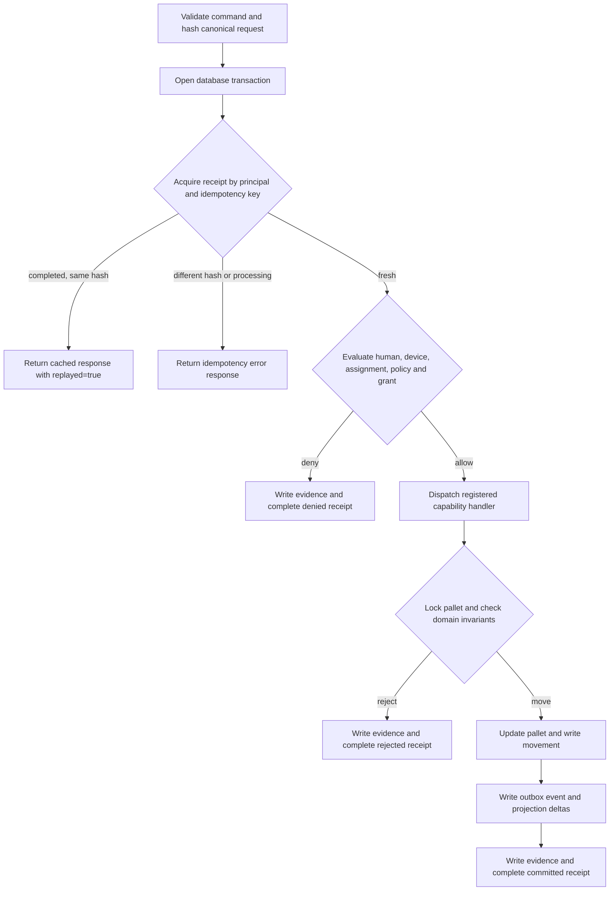

# Actualis core-kernel technical reference

## Current status

This workspace snapshot is a partial in-process kernel implementation.

- `Actualis.CapabilityRuntime.execute/1` provides a database-transaction boundary for governed commands.
- The registered `manufacturing.move_pallet` capability evaluates authority, locks and moves a pallet, records movement and evidence, appends an outbox event, creates operator and supervisor deltas, and completes a command receipt.
- `Actualis.Projection` provides authorized operator and supervisor snapshots and delta catch-up.
- Ecto schemas and the kernel migration define authority, manufacturing, execution, evidence, outbox, and projection records.
- A Phoenix JSON boundary exposes pallet movement, projection snapshots and deltas, evidence reads, health, and an executable OpenAPI 3.1 contract.
- The repository and umbrella project scaffolding exist. Kernel runtime and HTTP-boundary behavior tests are present alongside generated test support.
- No human-facing UI or outbox publisher is present.

The modules express an executable kernel and API contract, but not an end-user operating surface.

## Governed command flow

All fresh-command effects above run inside one repository transaction. An exception or failed bang operation rolls the transaction back and is returned by `execute/1` as `execution_failed`.

## Command contract

`CapabilityRuntime.Command` requires principal and device UUIDs, purpose, a registered capability, scope, input, a positive expected version, and an idempotency key. For the current pallet capability:

- `scope.site_id`, `input.pallet_id`, `input.source_location_id`, and `input.destination_location_id` must be UUIDs;
- purpose must contain 3–80 characters;
- movement reason must contain 3–500 bytes;
- idempotency key must contain 8–128 characters;
- the only registered consequential capability is `manufacturing.move_pallet`, version `0.1.0`, with site scope.

The canonical request hash normalizes map keys to strings, recursively sorts map entries, uses deterministic Erlang term encoding, and calculates a lowercase SHA-256 hexadecimal digest.

The top-level return contract is significant:

- malformed commands return `{:error, invalid_command}`;
- committed authorization denials and domain rejections return `{:ok, response}` with `response["ok"] == false`;
- successful or replayed commands return `{:ok, response}` with `response["ok"] == true`;
- a rolled-back transaction returns `{:error, execution_failed}`.

## HTTP boundary

The Phoenix router exposes these kernel routes:

| Method and path | Purpose | Governance |
|---|---|---|
| `GET /api/health` | Checks database connectivity | Public API pipeline |
| `GET /api/openapi.json` | Returns the implemented OpenAPI 3.1 specification | Public API pipeline |
| `POST /api/v1/capabilities/manufacturing.move_pallet` | Executes the governed movement command | Identity headers plus runtime authorization |
| `GET /api/v1/projections/:view/snapshot` | Returns an authorized operator or supervisor snapshot | Identity headers plus view authorization |
| `GET /api/v1/projections/:view/deltas` | Returns authorized deltas after a non-negative cursor | Identity headers plus view authorization |
| `GET /api/v1/evidence/:id` | Reconstructs retained evidence in a requested site and purpose | Identity headers plus `evidence.read` authorization |

The current identity plug is explicitly a development adapter. It accepts UUID values from `x-actualis-principal-id` and `x-actualis-device-id`; it does not verify OIDC credentials or device mTLS. Missing or invalid headers return HTTP 401 before controller dispatch.

The movement controller supplies the identity and capability, records request ID, remote IP, and user agent as client context, and maps authorization denial to 403; version, source, idempotency, and in-progress conflicts to 409; transactional failure to 500; and other domain or validation errors to 422. Evidence uses 403, 404, or 422. Projection reads use 403 or 422.

## Authority evaluation

A principal represents a human, device, integration, worker, or AI actor. Operator assignments bind a principal to a site for a validity period. Device records express site-bound trust. Versioned policies and capability grants model what a principal may do, for which scope and purpose, with field and obligation constraints.

`Actualis.Authority.evaluate/2` currently allows only when all of these checks pass at the evaluation time:

1. the acting principal exists and is an active human;
2. the supplied device principal is an active device with a trusted, unexpired record for the requested site;
3. the human has an assignment for that site whose validity has started and has not expired;
4. a site-scoped grant matches principal, capability, site ID, and purpose, and the grant has not expired;
5. the grant belongs to an approved policy whose effective time has started.

The most recently effective matching policy wins. An allowed decision returns permitted fields, masked fields, obligations, policy version, and the explanation `assigned_operator_with_active_grant`. A non-empty obligation list changes the decision name to `allow_with_obligations`; the runtime does not yet execute or verify those obligations.

## Pallet movement

A site owns named locations and pallets. A pallet has a label unique within a site, a material code, a current location, a quality status, and a positive version. A movement records source, destination, performer, reason, time, pallet version, and the command receipt that caused it.

`MovePallet.execute/3` selects and locks the pallet within the requested site, then checks in order:

1. the client expected version equals the stored version;
2. the claimed source equals the pallet's current location;
3. the pallet quality status is `released`;
4. the destination is active and belongs to the requested site;
5. source and destination differ.

It then changes the current location, increments the pallet version, and inserts the movement. Failures use stable codes: `pallet_not_found`, `version_conflict`, `source_location_conflict`, `quality_status_blocks_move`, `invalid_destination`, and `destination_unchanged`.

## Receipts, evidence, events, and projections

The receipt identity is principal plus idempotency key. Reusing the key with the same completed request returns the cached response with `replayed: true`. Reusing it for a different request returns `idempotency_key_reused`; finding it still processing returns `command_in_progress`.

Every fresh authorization denial, domain rejection, or success writes one evidence record and completes the receipt with outcome `denied`, `rejected`, or `committed`. A successful command also writes:

- one `manufacturing.pallet_moved.v1` outbox event on `manufacturing.material_movement`;
- one operator delta containing pallet, destination, version, status, and label;
- one supervisor delta adding material, source, reason, performer, and evidence identifiers.

Both deltas expire eight hours after the movement. Snapshot and delta access is independently re-authorized with `manufacturing.view_operator` or `manufacturing.view_supervisor`. Snapshots use a repeatable-read transaction. Delta reads return up to 500 unexpired, unrevoked rows after the supplied cursor. Both paths reduce each payload to the grant's `permitted_fields`; `masked_fields` is returned in the decision but is not separately applied.

## Confirmed invariants

| Area | Confirmed rule |
|---|---|
| Identifiers | Kernel entities use binary UUID primary and foreign keys, except the projection-delta cursor, which is a big serial value. |
| Time | Ecto schema timestamps use microsecond UTC timestamps. |
| Principal | `kind` is human, device, integration, worker, or AI; status is active, suspended, or revoked. External subject is unique. |
| Device | A principal has at most one device record; device status is trusted, quarantined, or revoked. |
| Assignment | A principal has at most one assignment record per site. |
| Policy | Policy version is unique; status is draft, approved, or retired. |
| Grant | The identity tuple is principal, policy version, capability, scope ID, and purpose. |
| Location | Location code is unique within a site. |
| Pallet | Pallet label is unique within a site; quality status is released, hold, or quarantined; version is positive. |
| Command receipt | Idempotency key is unique per principal; status is processing or completed. |
| Movement and evidence | Each command receipt can be linked to at most one movement and one evidence record. |
| Pallet movement | The handler locks the pallet, requires a matching positive version and source, permits only released pallets, and requires a different active destination within the requested site. |
| Governed command | Fresh denial, rejection, and success effects commit atomically with the receipt; raised persistence failures roll back the transaction. |
| Projection delta | Event and projection form a unique pair; catch-up reads order by the serial cursor, exclude expired or revoked rows, and return at most 500. |

Database checks back the enumerated principal, device, policy, pallet, and command-receipt states. Some schema-level validations have no equivalent database check.

## Important open contracts

These gaps should remain visible until they are implemented and verified:

- test coverage remains incomplete for authority denial variants, evidence reads, delta catch-up, failure rollback, and operational recovery;
- no human-facing interface exposes commands, receipts, evidence, snapshots, or deltas;
- the development identity adapter trusts caller-provided UUID headers and must be replaced with verified human and device credentials before production use;
- obligations are reported but not enforced, and masked fields are not separately transformed;
- the policy `definition` and `approved_by` fields do not affect evaluation;
- no publisher processes the outbox, and no lifecycle process revokes or deletes expired deltas;
- recovery for receipts left in `processing` is not defined;
- initial pallet writes are not shown to enforce that the current location belongs to the pallet's site at the database level;
- projection capabilities are authorization names but are not entries in the consequential-capability registry;
- `execution_failed` includes an inspected internal reason and needs a safe external-boundary policy;
- all success, denial, conflict, idempotency, and rollback paths still need executable tests.

## Source map

| Concern | Source | What it proves |
|---|---|---|
| Shared identifiers and timestamps | [`schema.ex`](../../../apps/actualis_core/lib/actualis/schema.ex) | Ecto primary-key, foreign-key, and timestamp convention |
| Application and repository | [`application.ex`](../../../apps/actualis_core/lib/actualis/application.ex), [`repo.ex`](../../../apps/actualis_core/lib/actualis/repo.ex), and [`config/`](../../../config) | Supervision, PostgreSQL adapter, and environment configuration |
| Authority evaluation | [`authority.ex`](../../../apps/actualis_core/lib/actualis/authority.ex) and [`authority/`](../../../apps/actualis_core/lib/actualis/authority) | Decision checks, codes, decision shape, and persisted authority records |
| Command transaction | [`capability_runtime.ex`](../../../apps/actualis_core/lib/actualis/capability_runtime.ex) and [`capability_runtime/`](../../../apps/actualis_core/lib/actualis/capability_runtime) | Validation, canonical hashing, registry, idempotency, dispatch, and effect ordering |
| Pallet movement | [`manufacturing/`](../../../apps/actualis_core/lib/actualis/manufacturing) | Site, location, pallet and movement records plus movement invariants and errors |
| Receipts and outbox | [`execution/`](../../../apps/actualis_core/lib/actualis/execution) | Receipt lifecycle and outbox event record contract |
| Evidence | [`evidence/`](../../../apps/actualis_core/lib/actualis/evidence) | Evidence data shape and one-record-per-receipt constraint |
| Projections | [`projection.ex`](../../../apps/actualis_core/lib/actualis/projection.ex) and [`projection/`](../../../apps/actualis_core/lib/actualis/projection) | Authorization, snapshots, field filtering, cursor catch-up, expiry, and revocation filters |
| JSON transport | [`actualis_web/`](../../../apps/actualis_web) | Routes, development identity resolution, controller parameters, response codes, and health behavior |
| Full persistence contract | [`20260718090000_create_actualis_kernel.exs`](../../../apps/actualis_core/priv/repo/migrations/20260718090000_create_actualis_kernel.exs) | Tables, references, checks, unique constraints, and query indexes |

Verification on 2026-07-18: `bin/mix-local test` passed 9 core tests and 6 web tests. The behavior tests cover governed movement, replay, identity-header rejection, an operator projection, and the OpenAPI route. This page still requires re-verification as that suite expands.

## Documentation maintenance

Follow the [core-kernel documentation workflow](../../process/documentation-workflow.md). The paired end-user explanation is the [core-kernel user guide](../../user/core-kernel/README.md). Re-verify this page whenever any mapped kernel source, migration, policy contract, command flow, or test changes.
